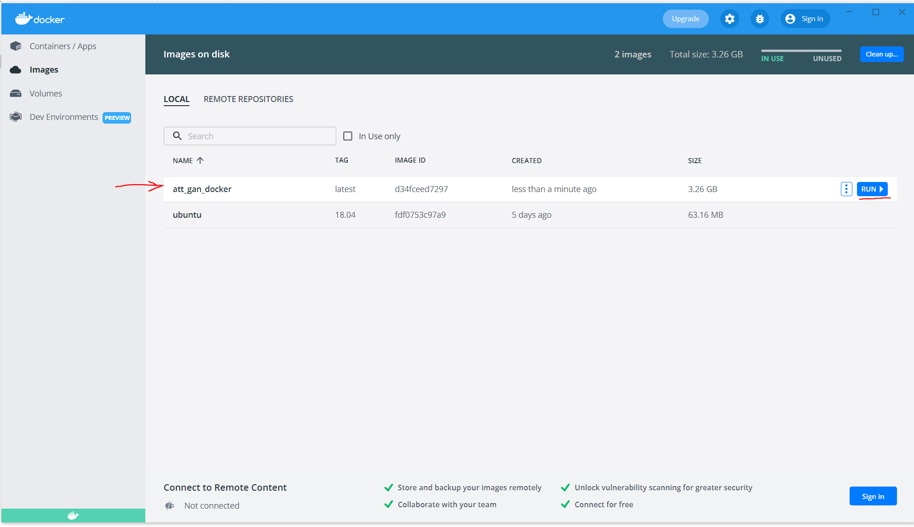
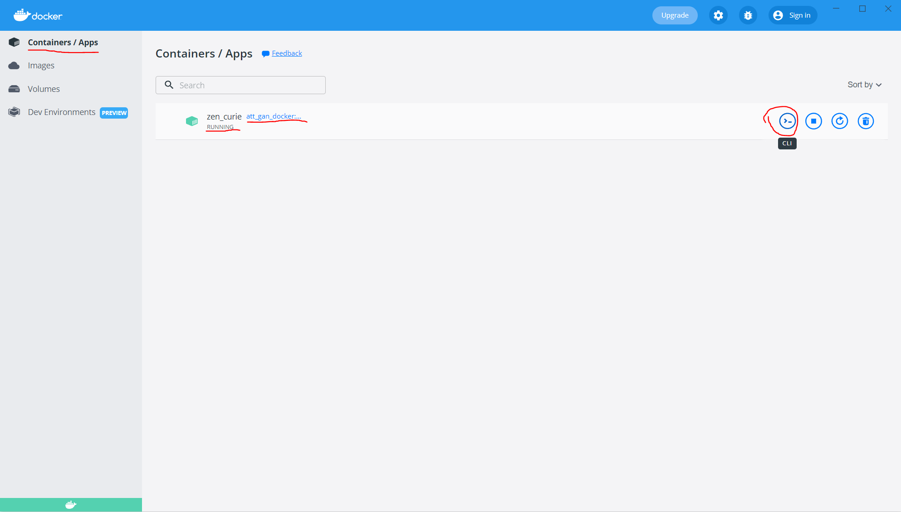
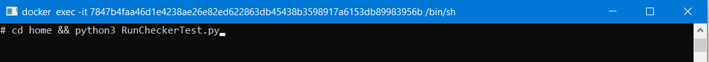
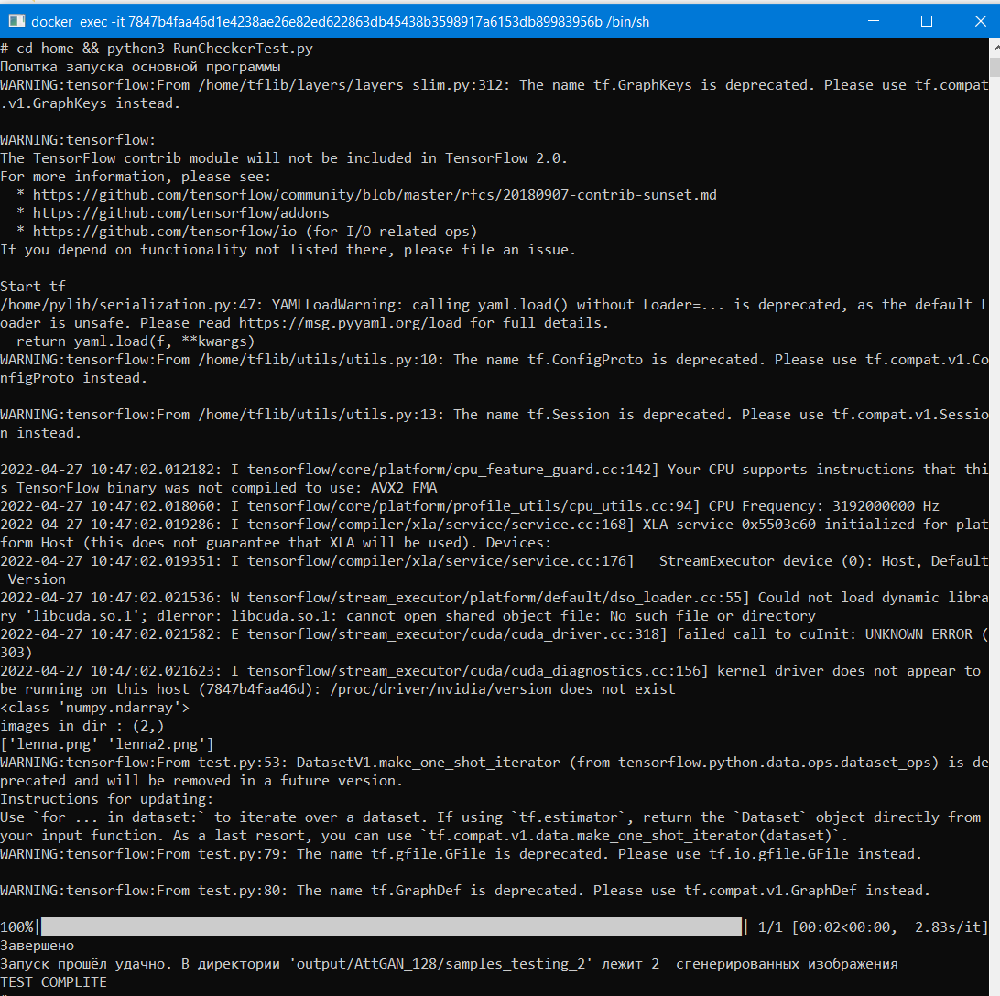

## Информация

- Этот репозиторий был скопирован от сюда [AttGAN-Tensorflow](https://github.com/LynnHo/AttGAN-Tensorflow)

## Информация с оригинального репозитория (для инструкций запуска см. после этого раздела)

- Environment

    - Python 3.6

    - TensorFlow 1.15

    - OpenCV, scikit-image, tqdm, oyaml

    - *we recommend [Anaconda](https://www.anaconda.com/distribution/#download-section) or [Miniconda](https://docs.conda.io/en/latest/miniconda.html#linux-installers), then you can create the AttGAN environment with commands below*

        ```console
        conda create -n AttGAN python=3.6

        source activate AttGAN

        conda install opencv scikit-image tqdm tensorflow-gpu=1.15

        conda install -c conda-forge oyaml
        ```

    - *NOTICE: if you create a new conda environment, remember to activate it before any other command*

        ```console
        source activate AttGAN
        ```

- Data Preparation

    - Option 1: [CelebA](http://openaccess.thecvf.com/content_iccv_2015/papers/Liu_Deep_Learning_Face_ICCV_2015_paper.pdf)-unaligned (higher quality than the aligned data, 10.2GB)

        - download the dataset

            - img_celeba.7z (move to **./data/img_celeba/img_celeba.7z**): [Google Drive](https://drive.google.com/drive/folders/0B7EVK8r0v71pTUZsaXdaSnZBZzg) or [Baidu Netdisk](https://pan.baidu.com/s/1CRxxhoQ97A5qbsKO7iaAJg) (password rp0s)

            - annotations.zip (move to **./data/img_celeba/annotations.zip**): [Google Drive](https://drive.google.com/file/d/1xd-d1WRnbt3yJnwh5ORGZI3g-YS-fKM9/view?usp=sharing)

        - unzip and process the data

            ```console
            7z x ./data/img_celeba/img_celeba.7z/img_celeba.7z.001 -o./data/img_celeba/

            unzip ./data/img_celeba/annotations.zip -d ./data/img_celeba/

            python ./scripts/align.py
            ```

    - Option 2: CelebA-HQ (we use the data from [CelebAMask-HQ](https://github.com/switchablenorms/CelebAMask-HQ), 3.2GB)

        - CelebAMask-HQ.zip (move to **./data/CelebAMask-HQ.zip**): [Google Drive](https://drive.google.com/open?id=1badu11NqxGf6qM3PTTooQDJvQbejgbTv) or [Baidu Netdisk](https://pan.baidu.com/s/1wN1E-B1bJ7mE1mrn9loj5g)

        - unzip and process the data

            ```console
            unzip ./data/CelebAMask-HQ.zip -d ./data/

            python ./scripts/split_CelebA-HQ.py
            ```

- Run AttGAN

    - training (see [examples.md](./examples.md) for more training commands)

        ```console
        \\ for CelebA
        CUDA_VISIBLE_DEVICES=0 \
        python train.py \
        --load_size 143 \
        --crop_size 128 \
        --model model_128 \
        --experiment_name AttGAN_128

        \\ for CelebA-HQ
        CUDA_VISIBLE_DEVICES=0 \
        python train.py \
        --img_dir ./data/CelebAMask-HQ/CelebA-HQ-img \
        --train_label_path ./data/CelebAMask-HQ/train_label.txt \
        --val_label_path ./data/CelebAMask-HQ/val_label.txt \
        --load_size 128 \
        --crop_size 128 \
        --n_epochs 200 \
        --epoch_start_decay 100 \
        --model model_128 \
        --experiment_name AttGAN_128_CelebA-HQ
        ```

    - testing

        - **single** attribute editing (inversion)

            ```console
            \\ for CelebA
            CUDA_VISIBLE_DEVICES=0 \
            python test.py \
            --experiment_name AttGAN_128

            \\ for CelebA-HQ
            CUDA_VISIBLE_DEVICES=0 \
            python test.py \
            --img_dir ./data/CelebAMask-HQ/CelebA-HQ-img \
            --test_label_path ./data/CelebAMask-HQ/test_label.txt \
            --experiment_name AttGAN_128_CelebA-HQ
            ```


        - **multiple** attribute editing (inversion) example

            ```console
            \\ for CelebA
            CUDA_VISIBLE_DEVICES=0 \
            python test_multi.py \
            --test_att_names Bushy_Eyebrows Pale_Skin \
            --experiment_name AttGAN_128
            ```

        - attribute sliding example

            ```console
            \\ for CelebA
            CUDA_VISIBLE_DEVICES=0 \
            python test_slide.py \
            --test_att_name Pale_Skin \
            --test_int_min -2 \
            --test_int_max 2 \
            --test_int_step 0.5 \
            --experiment_name AttGAN_128
            ```

    - loss visualization

        ```console
        CUDA_VISIBLE_DEVICES='' \
        tensorboard \
        --logdir ./output/AttGAN_128/summaries \
        --port 6006
        ```

    - convert trained model to .pb file

        ```console
        python to_pb.py --experiment_name AttGAN_128
        ```

- Using Trained Weights

    - alternative trained weights (move to **./output/\*.zip**)

        - [AttGAN_128.zip](https://drive.google.com/file/d/1Oy4F1xtYdxj4iyiLyaEd-dkGIJ0mwo41/view?usp=sharing) (987.5MB)

            - *including G, D, and the state of the optimizer*

        - [AttGAN_128_generator_only.zip](https://drive.google.com/file/d/1lcQ-ijNrGD4919eJ5Dv-7ja5rsx5p0Tp/view?usp=sharing) (161.5MB)

            - *G only*

        - [AttGAN_384_generator_only.zip](https://drive.google.com/open?id=1scaKWcWIpTfsV0yrWCI-wg_JDmDsKKm1) (91.1MB)


    - unzip the file (AttGAN_128.zip for example)

        ```console
        unzip ./output/AttGAN_128.zip -d ./output/
        ```

    - testing (see above)


- Example for Custom Dataset

    - [AttGAN-Cartoon](https://github.com/LynnHo/AttGAN-Cartoon-Tensorflow)

## Запуск проекта

- Этот проект настроен выполняться в docker среде

- Склонировать этот репозиторий

    ```console
    git clone https://github.com/NikolaySokolov152/AttGAN.git
    ```

- Скачать и распаковать обученные веса [AttGAN_128_generator_only.zip](https://drive.google.com/file/d/1lcQ-ijNrGD4919eJ5Dv-7ja5rsx5p0Tp/view?usp=sharing) (161.5MB) в папку output (если её нет, то создать)

- Создать docker image 

    ```console
    docker build -t att_gan_docker .
    ```

    - после этого запустится процесс сборки, в конце которого репозиторий будет скопирован в докер

        ```console
        docker run att_gan_docker
        ```

- Запустить построенный докер можно и через API docker



- Запустить CLI консоль



- Запустить тестовый скрипт

    ```console
    cd home && python3 RunCheckerTest.py
    ```

    
    
    

    - Если тест запустится удачно, то будет создана папка samples_testing_2 в output/AttGAN_128
                
        - Печать имен полученных картинок

            ```console
            cd output/AttGAN_128/samples_testing_2 && ls
            ```

#### Возможные проблемы

- основной тестирующий скрипт RunCheckerTest.py выполняет системный вызов test.py 

    ```console
    32 os.system('python3 test.py --experiment_name AttGAN_128')
    ```

      - если python3 не найден или его вызов пишет в консоль Python3, то заменить на python

- если качество пользовательских изображений является плохим, то это нормально, так как изображения нужно выравнивать специальной процедурой, о которой авторы кода не уточняли
